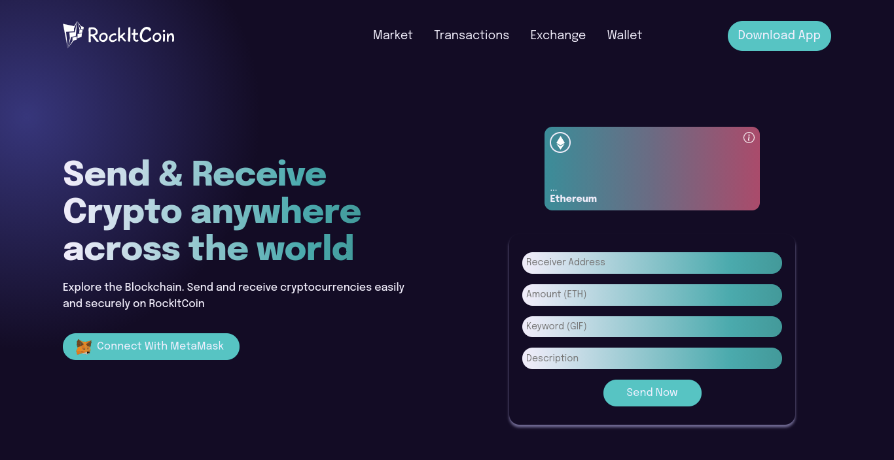

# RockItCoin - Web 3.0 Cryptocurrency App

## Introduction

A Web 3.0 cryptocurrency app built using some of the modern technologies in the Blockchain space.

### Built With & Tools

1. **React**
2. **CSS3**
3. **Solidity**
4. Metamask
5. Hardhat
6. Ropsten testnet faucet (testing)
7. Alchemy

### [Live Demo](https://www.rockitcoin.netlify.com/)
